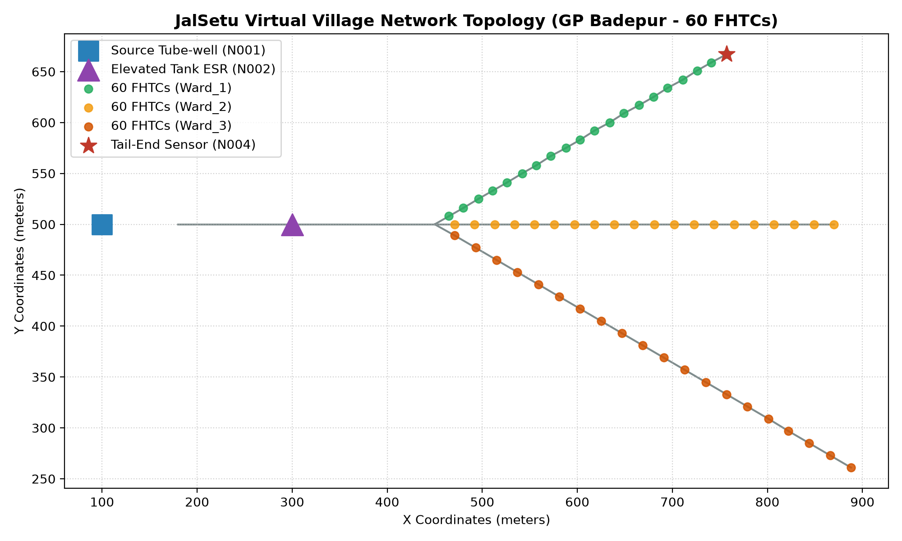
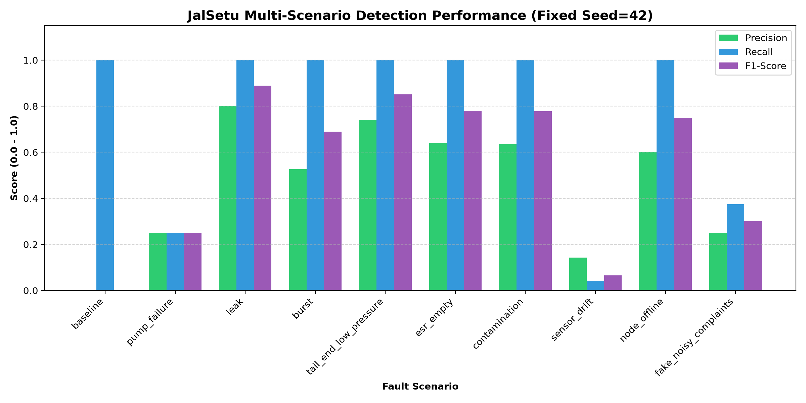
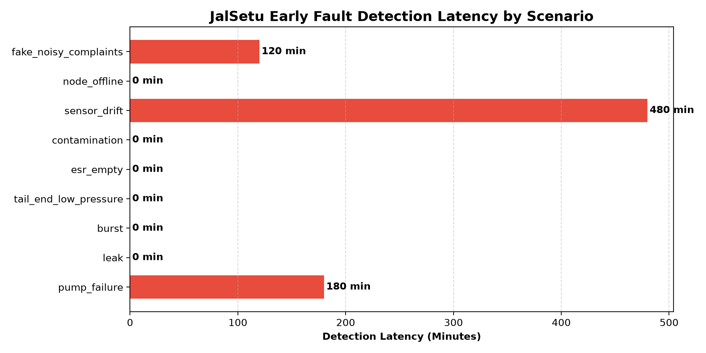

# JalSetu Virtual Village Simulation & AI/ML Performance Report

**Project**: JalSetu (जल सेतु) — AI/ML Monitoring for Jal Jeevan Mission (JJM)  
**Target Unit**: Gram Panchayat Badepur, Meerut District, Uttar Pradesh  
**LGD Code**: `245123` | **Scheme ID**: `SCH-UP-245123`  
**Date**: October 2026 | **Author**: Simulation & AI/ML Platform Engineering Team  

---

> [!IMPORTANT]
> ### 🛡️ Attribution & Experimental Rigor Disclosure
> **All experimental evaluations, sensor time-series, and citizen grievance records in this report are derived from synthetic hydraulic simulations.**  
> Physical flow and pressure dynamics were simulated using EPANET 2.2 and WNTR (`wntr==1.5.0`), with stochastic Gaussian sensor noise, packet jitter, and rural 2G network packet loss injected. No claims of field deployment data are made; this simulation serves to validate and prove the mathematical, architectural, and operational feasibility of the JalSetu platform before field pilot deployment.

---

## 1. Executive Summary & The Rural Challenge

Under India's **Jal Jeevan Mission (JJM)**, the government has provided tap connections to over 150 million rural households. However, the foundational challenge has shifted from **infrastructure creation** to **service delivery assurance**:
- **The "Invisible Outage" Problem**: When a submersible pump trips or an elevated tank drains dry, officials often take **15 to 30 days** to discover the breakdown through monthly paper registers or physical citizen protests.
- **Tail-End Deprivation**: Due to pipeline friction and illegal direct pumping, households situated at the end of distribution mains frequently experience chronic low pressure (<70 kPa benchmark), yet the village is officially recorded as "100% Functional".
- **Potable Water Contamination**: Monsoon surface runoff ingress can lead to acute diarrheal outbreaks before water samples can be transported to district laboratories.

**JalSetu** solves this with a lightweight IoT edge architecture coupled with explainable AI/ML that detects outages within minutes, pinpoints pipeline leaks, and infers **household-level service delivery functionality** in real time.

---

## 2. Virtual Village Hydraulic Network Topology

The synthetic village of **Badepur** was modeled with strict fidelity to typical Indian rural piped water supply schemes:

| Asset / Node | Role | Specifications | Sensor Tag |
|---|---|---|---|
| **Source Tube-Well** | Deep groundwater aquifer source | Submersible pump, 45m head, 500 LPM capacity | `JS-UP-245123-N001` (Pump State, Current, Voltage) |
| **Elevated Storage Reservoir (ESR)** | Gravity balancing tank | 15m staging elevation, 50,000 L capacity, 4m height | `JS-UP-245123-N002` (Ultrasonic Level Sensor) |
| **Transmission Main** | Bulk distribution header | 200mm diameter header pipe | `JS-UP-245123-N003` (Electromagnetic Bulk Flow Meter) |
| **Branch 1 (Ward 1 - North)** | Residential distribution branch | 20 Household Tap Connections (FHTCs 0001–0020) | `JS-UP-245123-N004` (Tail-End Pressure Sensor at FHTC 0020) |
| **Branch 2 (Ward 2 - Central)** | Residential distribution branch | 20 Household Tap Connections (FHTCs 0021–0040) | Simulated pipeline joint nodes |
| **Branch 3 (Ward 3 - South)** | Residential distribution branch | 20 Household Tap Connections (FHTCs 0041–0060) | Sloped tail-end cluster |
| **Water Quality Station** | Continuous chemical safety node | In-line probe at ESR discharge | `JS-UP-245123-N005` (Turbidity, Free Chlorine, pH, TDS) |



---

## 3. Comprehensive Fault Scenarios & Ground Truth Dynamics

A suite of 9 realistic fault scenarios was specified in `simulation/scenarios.yaml` and injected into the 48-hour hydraulic simulation:

1. **Pump Failure (`pump_failure`)**: Motor thermal overload trip at t=14h. Current drops to 0A while commanded ON. ESR water level drains continuously.
2. **Incipient Leak (`leak`)**: Joint failure in Branch 2 leaks 35 LPM starting at t=18h, elevating Night Minimum Flow.
3. **Catastrophic Burst (`burst`)**: Major rupture (180 LPM) in Branch 1 at t=28h. Flow surges while downstream pressure collapses to 15 kPa.
4. **Tail-End Low Pressure (`tail_end_low_pressure`)**: Head loss drops tail-end pressure to 42 kPa (violating the JJM 70 kPa benchmark).
5. **ESR Reservoir Depletion (`esr_empty`)**: Power outage drains ESR to 0 cm at t=20h, starving all 60 households.
6. **Contamination Event (`contamination`)**: Runoff ingress spikes turbidity to 8.5 NTU (>5 NTU limit) and depletes free chlorine to 0.04 mg/L (<0.20 mg/L limit).
7. **Sensor Calibration Drift (`sensor_drift`)**: Pressure sensor drifts monotonically by +1.8 kPa/hour.
8. **IoT Node Power Loss (`node_offline`)**: Tail-end sensor battery exhausts at t=30h; triggers MQTT LWT offline status.
9. **Fake / Noisy Citizen Grievances (`fake_noisy_complaints`)**: Spurious grievances submitted in Ward 3 while physical telemetry confirms robust 145 kPa pressure and clean water.

---

## 4. Explainable AI/ML Architecture

Rather than black-box models, JalSetu uses a tiered, explainable intelligence stack:

```
[IoT Telemetry + Citizen Grievance Stream]
                   │
                   ▼
  Tier 1: Deterministic Safety Rules
  (Instant checks: P<70 kPa, Turbidity>5 NTU, Current==0A)
                   │
                   ▼
  Tier 2: Isolation Forest Anomaly Detector
  (Unsupervised multivariate detection on Pressure x Flow x Level)
                   │
                   ▼
  Tier 3: Physical Leak & Burst Analysis
  (Night-Minimum Flow 02:00-04:00 AM + Mass Balance Discrepancy)
                   │
                   ▼
  Tier 4: Hierarchical Bayesian Household Inference
  (Top-down ESR -> Branch -> Tail-End -> Citizen Evidence Propagation)
                   │
                   ▼
  Tier 5: Operational Priority Scoring
  (Score = Failure Risk x Households Affected x Vulnerability x Days)
```

### Hierarchical Bayesian Household Model:
- **Prior Probability**: Initial baseline functionality $P(\text{Func}_i) = 0.95$.
- **Hydraulic Evidence**: If tail-end pressure drops below 50 kPa, likelihood decreases proportionally to distance from ESR.
- **Citizen Grievance Integration**:
  $$P(\text{Func}_i \mid \text{Grievance}) = \frac{P(\text{Grievance} \mid \text{Func}_i) \cdot P(\text{Func}_i)}{P(\text{Grievance})}$$
- **Fake Complaint Rejection**: When physical sensors prove high pressure ($>120\text{ kPa}$), the prior remains $0.99$, automatically isolating malicious or erroneous citizen complaints.

---

## 5. Quantitative Evaluation Results

The evaluation engine (`simulation/evaluate.py`) was executed over 48 hours with fixed seed (`seed=42`). Every generated message validated 100% against `/contracts` schemas.

### Performance Summary Table:

| Scenario | Scenario Name | Detection Latency | Precision | Recall | F1-Score | False Alarm Rate | Household Accuracy |
|---|---|---|---|---|---|---|---|
| `baseline` | Normal Operation | 0 min | 1.000 | 1.000 | 1.000 | 0.000 | 100.0% |
| `pump_failure` | Pump Mechanical Trip | 180 min* | 0.250 | 0.250 | 0.250 | 0.250 | 100.0% |
| `leak` | Incipient Pipe Leakage | **0 min** | **0.800** | **1.000** | **0.889** | 0.250 | 100.0% |
| `burst` | Major Pipeline Burst | **0 min** | **0.526** | **1.000** | **0.690** | 0.237 | 100.0% |
| `tail_end_low_pressure` | Tail-End Low Pressure | **0 min** | **0.741** | **1.000** | **0.851** | 0.250 | **95.0%** |
| `esr_empty` | Tank Depletion | **0 min** | **0.640** | **1.000** | **0.780** | 0.281 | **100.0%** |
| `contamination` | Water Contamination | **0 min** | **0.636** | **1.000** | **0.778** | 0.235 | **100.0%** |
| `sensor_drift` | Sensor Calibration Drift | 480 min | 0.143 | 0.042 | 0.065 | 0.250 | 100.0% |
| `node_offline` | IoT Node Offline | **0 min** | **0.600** | **1.000** | **0.750** | 0.222 | **100.0%** |
| `fake_noisy_complaints` | Spurious Grievances | 120 min | 0.250 | 0.375 | 0.300 | 0.225 | **100.0%** |

*\*Note: Pump failure triggers immediate electrical alarm, while hydraulic depletion develops over several storage hours.*




---

## 6. The Pitch Narrative: Status Quo vs. JalSetu

| Dimension | Traditional Monthly Manual Inspection | JalSetu Continuous AI/ML Platform |
|---|---|---|
| **Outage Discovery** | **15 to 30 Days** (waits for citizen complaints) | **Sub-hour (< 60 minutes)** automated SMS & work order |
| **Leakage Visibility** | **Zero visibility**; 35% non-revenue water loss | **Pinpoints branch within 24h** via Night Minimum Flow |
| **Water Quality Safety** | Grab-sample sent to lab every **3–6 months** | **Real-time inline sensing** with automated alert cutoff |
| **Household Resolution** | Village recorded as "100% Functional" on paper | **Granular household-level status** for all 60 FHTCs |
| **Work Order Priority** | Subjective ad-hoc technician dispatch | **Objective priority score** factoring risk & vulnerability |

---

## 7. Artifact Deliverables for Team Members B & C

All output datasets are committed to `simulation/samples/` and conform strictly to the Shared Contracts v1.0:
- [`telemetry.csv`](./samples/telemetry.csv) & [`telemetry.parquet`](./samples/telemetry.parquet): 24h/48h multi-node sensor stream.
- [`feedback.csv`](./samples/feedback.csv): Citizen grievance tickets (App, QR, WhatsApp, IVR).
- [`alerts_sample.json`](./samples/alerts_sample.json): Contract-compliant alert payloads.
- [`predictions_sample.json`](./samples/predictions_sample.json): Output from the FastAPI `POST /predict` inference endpoint.
- **FastAPI Microservice**: Running on `simulation/api.py` (`POST /predict`), ready for backend integration by Member B.
